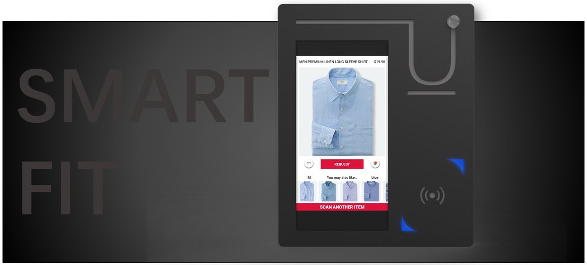
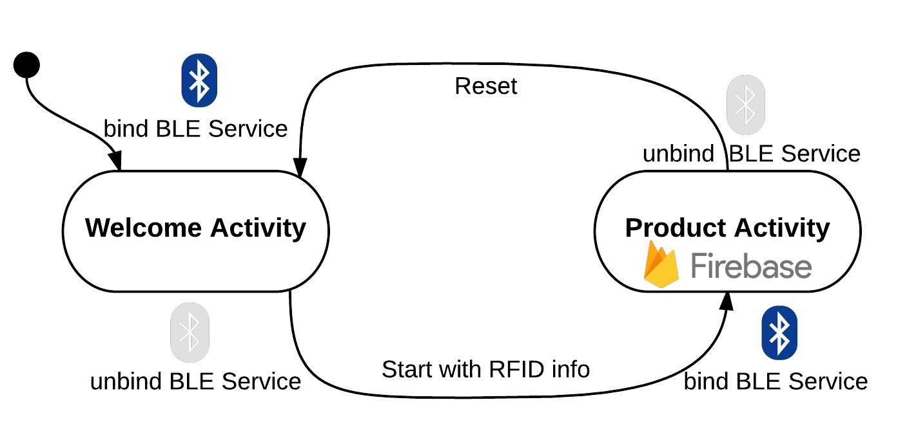
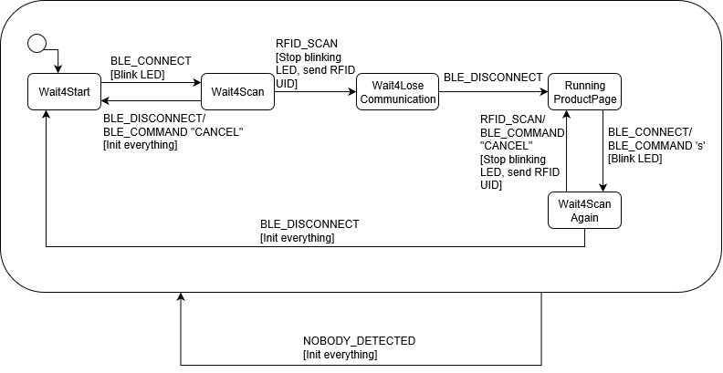

# Smart Fit
Smart Fit is a IoT product designed and built by [Chi Zhang](https://www.linkedin.com/in/zhang-chi/), [Jiajie He](https://www.linkedin.com/in/jiajie-he/), [Jang Won Suh](https://www.linkedin.com/in/jang-won-suh-371123b8/) and [Supanath Juthacharoenwong](https://www.linkedin.com/in/supanath-juthacharoenwong-02754353/). It is also a team project for Mechaphonics: Smart Phone-Enabled Mechatronic Systems[(ME202)](http://explorecourses.stanford.edu/search?view=catalog&filter-coursestatus-Active=on&page=0&catalog=&academicYear=&q=Mechaphonics&collapse=) at Stanford University, Spring 2017.

<p align="center">

</p>

:warning: This page serves as software description, please refer to the project [website](http://me202smartfit.weebly.com/) for more details on mechanical and eletrical systems setup.

## Requirements 
### 
- [Android 6.0 Marshmallow](https://www.android.com/versions/marshmallow-6-0/) with API 23
- [Android SDK 25.3.0](https://developer.android.com/studio/releases/sdk-tools.html)
- [Android Bluetooth Low Energy Service](https://developer.android.com/guide/topics/connectivity/bluetooth-le.html)
### 
- [Arduino 1.69](https://www.arduino.cc/) with ES Framework by [J. Edward Carryer](https://profiles.stanford.edu/j-edward-carryer)

### Third-party Services and Libraries
- [Google Firebase](https://firebase.google.com/)
- [Butter Knife](http://jakewharton.github.io/butterknife/)
- [Picasso](http://square.github.io/picasso/)
- [Android GIF drawable](https://github.com/koral--/android-gif-drawable)
- [Android Circular Progress Button](https://github.com/dmytrodanylyk/circular-progress-button)
- [Adafruit BluefruitLE nRF51](https://learn.adafruit.com/introducing-the-adafruit-bluefruit-le-uart-friend/software)
- [Adafruit PN532 RFID](https://github.com/adafruit/Adafruit-PN532)

## Android Dependencies
### app level
```groovy
dependencies {
    compile 'com.android.support:appcompat-v7:25.3.1'
    // Access to Android Design library
    compile 'com.android.support:design:25.3.1'
    // Constraint layout
    compile 'com.android.support.constraint:constraint-layout:1.0.2'
    // Recycler view
    compile 'com.android.support:recyclerview-v7:25.3.1'
    // Image processing (Picasso)
    compile 'com.squareup.picasso:picasso:2.5.2'
    // View injector (Butter Knife)
    compile 'com.jakewharton:butterknife:8.5.1'
    // Gif views
    compile 'pl.droidsonroids.gif:android-gif-drawable:1.2.7'
    // Progress button
    compile 'com.github.dmytrodanylyk.circular-progress-button:library:1.1.3'
    testCompile 'junit:junit:4.12'
    annotationProcessor 'com.jakewharton:butterknife-compiler:8.5.1'
    // Firebase
    compile 'com.google.firebase:firebase-core:10.2.6'
    compile 'com.google.firebase:firebase-auth:10.2.6'
    compile 'com.google.firebase:firebase-database:10.2.6'
    compile 'com.google.firebase:firebase-storage:10.2.6'
}
```
For use of Google Services, you also need
```groovy
apply plugin: 'com.google.gms.google-services'
```
on the bottom of `build.gradle` in `app` folder.
### build level
```groovy
repositories {
        jcenter()
    }
    dependencies {
        classpath 'com.android.tools.build:gradle:2.3.2'
        // Google Services
        classpath 'com.google.gms:google-services:3.1.0'
    }
```

## Android App Workflow
<p align="center">

</p>

:exclamation: We realized that Bluetooth Service can only be binded with one activity at a time near the end of the project timeline, so the way we handled BLE (simply binding and unbinding when switching activities) was not elegant. We strongly suggest you use fragments inside one activity to achieve the same functionality.

## Android App GIF Demo
Fitting Room App           |    Merchant App
:-------------------------:|:-------------------------:
  |  

## Arduino State Machine
<p align="center">

</p>

## Copyright :copyright:
All trademarks and clothes photoes in the app are owned by Uniqlo Co., Ltd. The use of the copyrighted work involved in this project is for educational purposes, and should be considered fair use.
